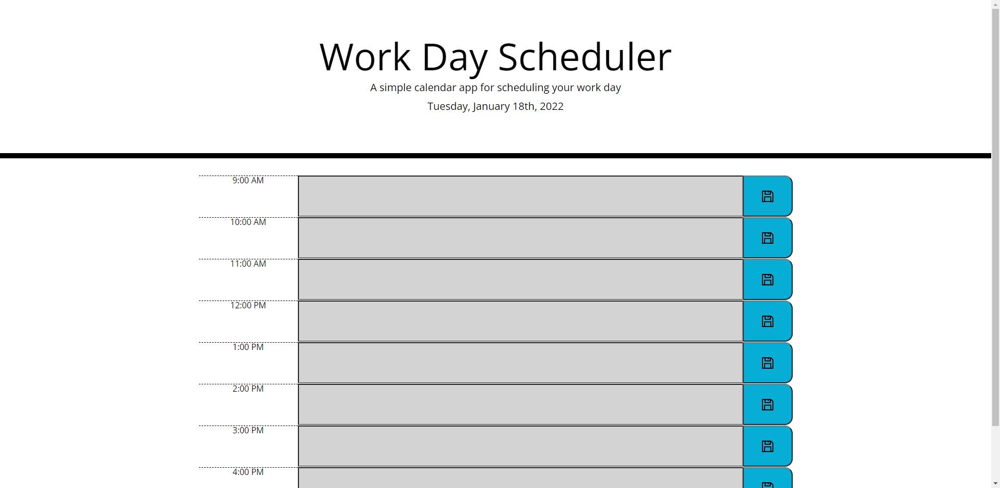
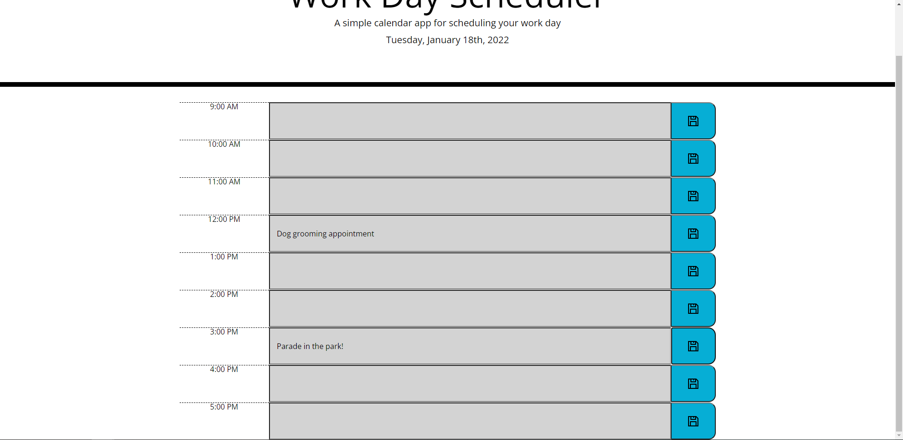
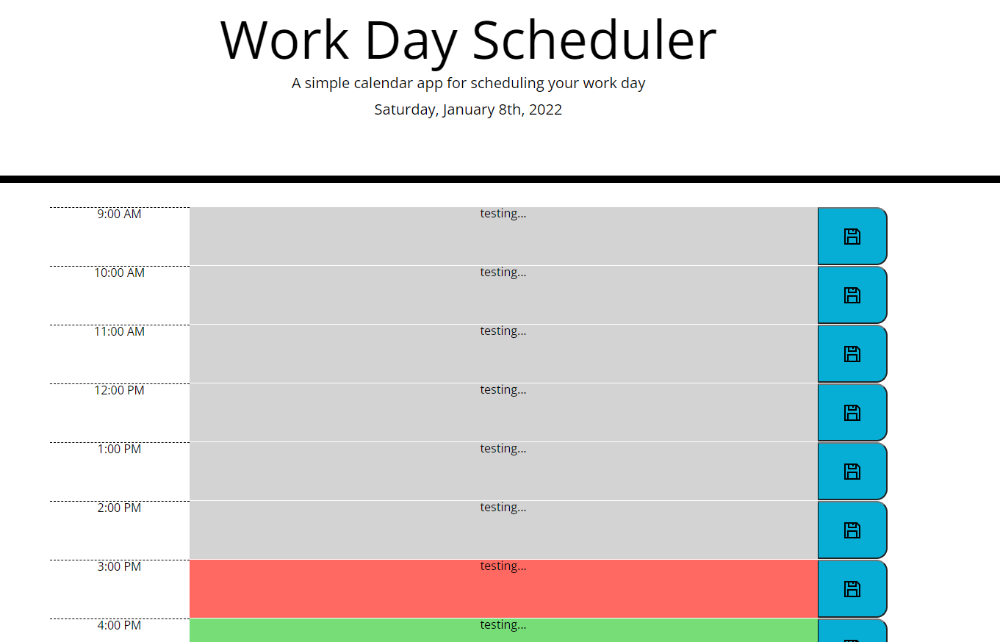

# Work Day Scheduler

Title: Work Day Scheduler    
Developer: Robyn Arnecke   
Deployment Date: January 18, 2022    
Published: GitHub https://ribbonanarchy.github.io/05-Unit5-Work-Day-Scheduler/    

---

## Summary

The Work Day Scheduler presents the user with a series of textboxes, one for each hour of the work day.

The user has an option to input text into any of the hours of the day, marking down what their tasks in specific hours. 

These text inputs are saved in local storage once the user hits the blue save button, so if the user refreshes or leaves the page and comes back their task will still be sitting in the correct hour, and can be further edited if they choose.

---

## Development

I started development by making sure the HTML had the elements that it needed, which was basically the header. I used moment.js to populate the header with the current date. 

The actual textboxes are created dynamically in the Javascript, and they are styled using Bootstrap.

An early screenshot shows that when you look at the page during working hours, the current hour is highlighted red, the future hours are highlighted green, and the past hours are gray. 

